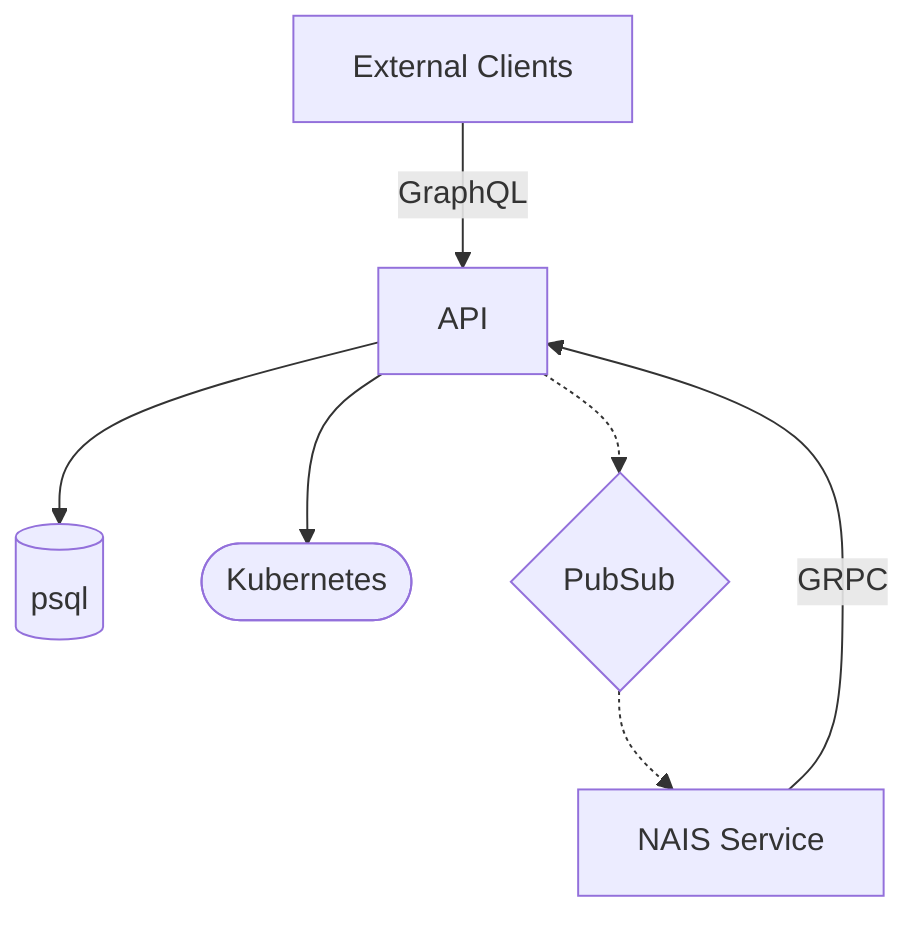

# NAIS API

NAIS API is the main entrypoint when interacting with the API of the NAIS platform.

## Local development

```bash
asdf install # Install required dependencies
docker compose up -d
make setup-local # Setup local environment (seeds database and creates pubsub topic)
make local
```

For local development you need to set the `WITH_FAKE_CLIENTS` environment variable to `true` (as set by `make local`),
and you will also need to set the `X-User-Email` header to `dev.usersen@example.com` if you want to act as a regular
user, or `admin.usersen@example.com` if you need an admin user.

## Practices

### Graph-API

We have defined a set of practices for the Graph-API in the [docs/graphql_practices.md](docs/graphql_practices.md) file.

## Fake clients

We have a set of fake clients, and stubs, that can be used for local development.
One of the clients is a fake Kubernetes client that read data from `data/k8s`.
You can read more about how the fake clients works in the [data/k8s/README.md](data/k8s/README.md) file.

## Architecture



| Component        | Description                                                                                |
| ---------------- | ------------------------------------------------------------------------------------------ |
| API              | This service                                                                               |
| Postgres         | The postgres database storing state from this application                                  |
| NAIS Service     | Services by NAIS that requires special communication with API. E.g. Reconcilers and Deploy |
| External Clients | External clients that communicates with the API. E.g. Browsers and NADA                    |
| Kubernetes       | The Kubernetes clusters of the tenant                                                      |
| PubSub           | The PubSub topic used for communication between the API and the NAIS Service               |
