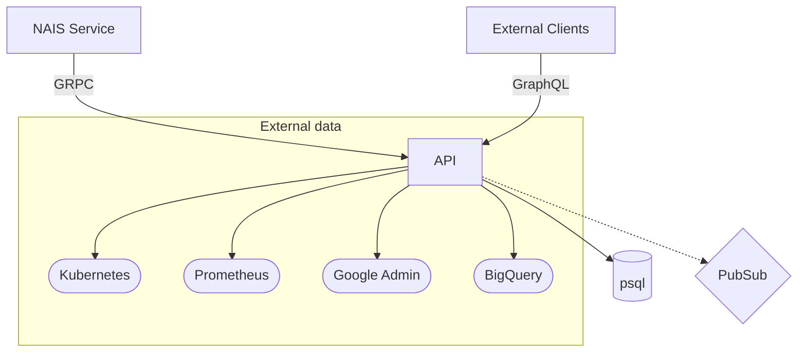

# NAIS API

NAIS API is the main entrypoint when interacting with the API of the NAIS platform.

## Local development

```bash
mise install # Install required dependencies
cp .env.example .env # Copy example configuration file, and adjust to your needs
docker compose up -d
make setup-local # Setup local environment (seeds database and creates pubsub topic)
make local
```

For local development you need to set the `WITH_FAKE_CLIENTS` environment variable to `true` (as set by `make local`),
and you will also need to set the `X-User-Email` header to `dev.usersen@example.com` if you want to act as a regular
user, or `admin.usersen@example.com` if you need an admin user, when interacting with the GraphQL API.

Locally, most external services are replaced with fake clients, and the Kubernetes client reads data from `data/k8s`.

The test suite uses [testcontainers](https://testcontainers.com/), and if you are using Colima you might need to follow
the guidelines in the [testcontainers documentation](https://golang.testcontainers.org/system_requirements/using_colima/).

## Development practices

Check practices used in this project here: [docs/practices.md](docs/practices.md)

### Graph-API

We have defined a set of practices for the Graph-API in the [docs/graphql_practices.md](docs/graphql_practices.md) file.

## Fake clients

We have a set of fake clients, and stubs, that can be used for local development.
One of the clients is a fake Kubernetes client that read data from `data/k8s`.
You can read more about how the fake clients works in the [data/k8s/README.md](data/k8s/README.md) file.

## Integration tests

We are using [tester](https://github.com/nais/tester) for integration tests.
These tests are written in Lua and can be found in the `integration_tests` directory.

A spec file is generated to support auto-completion using the Lua language server.

When running `make test` the integration tests will be run as part of the test suite.
If you only want to run the integration tests, and get information about coverage, you can run `make integration-test`.

To run the integration tests in watch mode, run `make integration_test_ui`.
This will start a web server on `localhost:9876` where you can see the test results.
They will be re-run every time you save a `.lua` file.

## Architecture



| Component        | Description                                                                                |
| ---------------- | ------------------------------------------------------------------------------------------ |
| API              | This service                                                                               |
| Postgres         | The postgres database storing state from this application                                  |
| NAIS Service     | Services by NAIS that requires special communication with API. E.g. Reconcilers and Deploy |
| External Clients | External clients that communicates with the API. E.g. Browsers and NADA                    |
| Kubernetes       | The Kubernetes clusters of the tenant                                                      |
| PubSub           | The PubSub topic used for communication between the API and the NAIS Service               |
| Prometheus       | We collect historic data from the tenants prometheus                                       |
| Google Admin     | We use the Google Admin API to manage a list of users                                      |
| BigQuery         | We collect historic cost data from BigQuery                                                |

## Code generated by GitHub Copilot

This repository uses GitHub Copilot to generate code.
