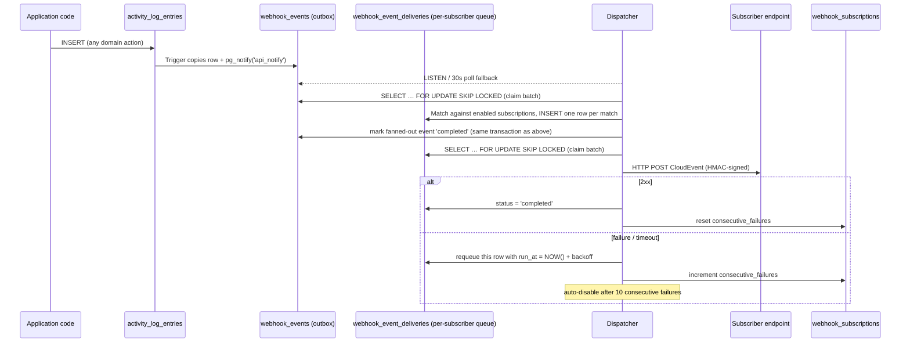

# Webhook System

Sends HTTP callbacks to user-registered endpoints when activity log events occur.
Supports team-scoped and global subscriptions, HMAC-signed CloudEvents 1.0 payloads,
durable delivery via a PostgreSQL outbox, and automatic retry with exponential backoff.

## Flow

Processing happens in two stages: outbox events are fanned out into per-subscription
delivery rows, and each delivery row is then retried independently of the others.



## Key components

| File             | Responsibility                                                         |
| ---------------- | ---------------------------------------------------------------------- |
| `dispatcher.go`  | Outbox consumer: LISTEN/NOTIFY + poll, fan-out, claim, deliver, retry  |
| `cleaner.go`     | Daily leader-only pruning of processed outbox/queue and old deliveries |
| `cloudevents.go` | Build CloudEvents 1.0 envelope; derive `type` from activity type       |
| `signer.go`      | HMAC-SHA256 payload signing (`X-Webhook-Signature` header)             |
| `model.go`       | Domain types; `MatchesEvent` subscription/event matching logic         |
| `queries.go`     | CRUD operations with authorisation                                     |
| `dataloader.go`  | Context-scoped DB + dispatcher access                                  |

## Database tables

- **`webhook_subscriptions`** — registered endpoints (URL, secret, event_types, team scope)
- **`webhook_events`** — lightweight outbox; each row is just a reference (`activity_log_entries_id`) to the source event, inserted by a PostgreSQL trigger on `activity_log_entries`. No data duplication. A row's job is done once it has been "fanned out" (see below); it doesn't track delivery outcomes itself.
- **`webhook_event_deliveries`** — one row per `(webhook_event, subscription)` match, created by the dispatcher's fan-out step. This is the actual unit of retry: `status`/`retry_count`/`run_at` here are scoped to a single subscriber's delivery of a single event, so retries never touch other subscribers.
- **`webhook_deliveries`** — audit log of every actual HTTP delivery attempt, optionally linked back to the `webhook_event_deliveries` row that produced it.

### Why two stages?

Subscription matching (event-type wildcards `*`, team scoping) is application logic that
lives in Go (`activitylog.RegisterActivityType`/`MatchesEvent`), so it can't be done by the
trigger. The trigger only records that an event happened; the dispatcher fans it out into
one delivery row per matching subscription, and retry/backoff bookkeeping happens at that
level.

## Multi-instance safety

The dispatcher is started on every API replica (`go webhookDispatcher.Run(ctx)`, unconditional — no leader election). This is safe:

- Postgres `NOTIFY` on `api_notify` is broadcast to every connection currently `LISTEN`ing on it, so all replicas wake up when new work arrives (plus a 30s poll fallback per replica in case a notification is missed).
- Both the fan-out claim (`ClaimOutboxEventsForFanout`) and the delivery claim (`ClaimPendingDeliveries`) use `SELECT ... FOR UPDATE SKIP LOCKED`. Concurrent replicas racing on these queries can never select the same row — whichever transaction locks a row first "wins" it, and everyone else's `SKIP LOCKED` simply skips it and claims different rows instead. More replicas just means more parallel draining capacity, never duplicate work.
- Fan-out (claiming an event, matching subscriptions, inserting delivery rows, marking the event completed) happens in a single DB transaction. `CreateEventDelivery` is idempotent (`ON CONFLICT (webhook_event_id, subscription_id) DO NOTHING`), so an interrupted or repeated fan-out attempt is safe.
- Delivery marks a `webhook_event_deliveries` row `completed` at claim time, before the HTTP call is made. A replica killed mid-delivery could lose that one delivery without a retry — a known trade-off; a `processing` status with a lease and reaper would close this gap if it becomes a problem in practice.

## Retention & cleanup

`RunCleaner` runs once a day on every replica, but only the current leader (via `leaderelection.IsLeader`) actually performs deletes, so pruning happens exactly once cluster-wide per interval:

- `webhook_events` and `webhook_event_deliveries` (internal processing state) are pruned after 7 days.
- `webhook_deliveries` (the user-facing delivery audit log) is pruned after 30 days.

## Event types

Event types are driven by `activitylog.RegisterActivityType` calls throughout the codebase.
Every registered activity type is automatically available as a subscribable event type. Option functions allow customising descriptions, grouping, or scope.

```go
// Any domain package's init():
activitylog.RegisterActivityType(
    "TEAM_MEMBER_ADDED",
    activitylog.ActivityLogEntryActionAdded,
    resourceType,
    activitylog.WithDescription("A user was added to the team"), // Custom description
    activitylog.WithGroup("Team"),                               // Custom UI grouping
)

// Global/admin-only event types can be marked so team-scoped webhooks cannot subscribe to them:
activitylog.RegisterActivityType(
    "RECONCILER_ENABLED",
    action,
    resourceType,
    activitylog.GlobalOnly(),
)
```

The `webhookEventTypes` GraphQL query exposes the full catalogue with descriptions, groups, and `teamScoped` status.

Subscription `event_types` accepts activity type names (e.g. `TEAM_MEMBER_ADDED`) or `*` for all events. If a team-scoped webhook tries to subscribe to a `GlobalOnly` event type, creation/update will fail validation.

## CloudEvents type mapping

The PostgreSQL trigger stores events as `RESOURCE_TYPE:ACTION` (e.g. `TEAM:ADDED`).
The dispatcher resolves this to an `ActivityLogActivityType` via `LookupActivityTypes`, then converts
it to a CloudEvents-spec type string:

```
TEAM_MEMBER_ADDED  →  io.nais.team.member.added
POSTGRES_DELETED   →  io.nais.postgres.deleted
```

### Idempotency / deduplication

The CloudEvents `id` field is set to the `webhook_event_deliveries` row's own id, which is
stable across retries of that specific `(event, subscription)` delivery — it does **not**
change if a delivery is retried after a failure. Subscribers that need exactly-once
processing semantics should treat delivery as **at-least-once** and deduplicate on `id`.

## Retry schedule

| Attempt | Delay    |
| ------- | -------- |
| 1       | 1 min    |
| 2       | 5 min    |
| 3       | 15 min   |
| 4       | 1 hour   |
| 5       | 4 hours  |
| 6       | 8 hours  |
| 7       | 12 hours |

After 7 failed attempts the delivery is marked `failed`. After 10 consecutive failures across
any deliveries, the subscription is automatically disabled (`enabled = false`, `disabled_at` set).
Retries and the failure counter are both scoped per subscriber — one broken subscriber
retrying (and eventually being auto-disabled) has no effect on other subscribers of the
same events.

## Authorisation

| Action              | Allowed                                    |
| ------------------- | ------------------------------------------ |
| Team-scoped webhook | Team owner                                 |
| Global webhook      | Admin (Go-level check, not a DB role)      |
| Update / delete     | Owner of the subscription's team, or admin |

## Monitoring & Metrics

The webhook domain exports telemetry using native OpenTelemetry metrics under the meter name `webhook`:

### PromQL Alerts Examples

1. **Increasing delivery queue size** (Potential worker blockage or overload):

   ```promql
   max(nais_api_webhook_queue_size{status="pending"}) > 100
   ```

   _Trigger conditions_: `nais_api_webhook_queue_size` reads shared Postgres state (a plain `COUNT(*) GROUP BY status`), so **every** replica reports the identical number — it is not gated behind leader election. Use `max()` or `avg()` when aggregating across replicas, **not `sum()`**, since summing would multiply the true value by the replica count.

2. **High webhook delivery failure rate**:

   ```promql
   sum(rate(webhook_deliveries_total{success="false"}[5m])) / sum(rate(webhook_deliveries_total[5m])) * 100 > 10
   ```

3. **Auto-disabled subscriptions rate**:

   ```promql
   sum(rate(webhook_subscriptions_auto_disabled_total[1h])) > 0
   ```
