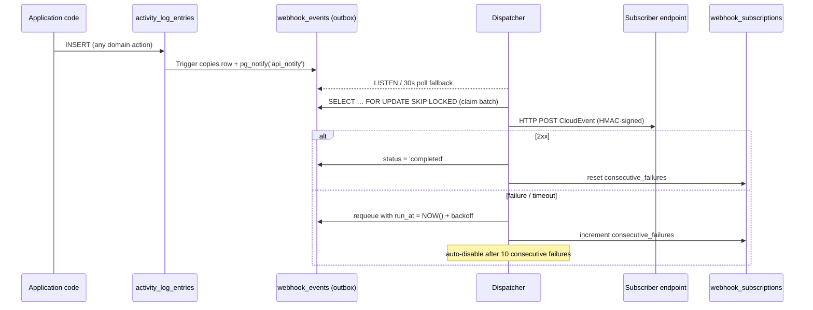

# Webhook System

Sends HTTP callbacks to user-registered endpoints when activity log events occur.
Supports team-scoped and global subscriptions, HMAC-signed CloudEvents 1.0 payloads,
durable delivery via a PostgreSQL outbox, and automatic retry with exponential backoff.

## Flow



## Key components

| File             | Responsibility                                                      |
| ---------------- | ------------------------------------------------------------------- |
| `dispatcher.go`  | Outbox consumer: LISTEN/NOTIFY + poll, claim events, deliver, retry |
| `cloudevents.go` | Build CloudEvents 1.0 envelope; derive `type` from activity type    |
| `signer.go`      | HMAC-SHA256 payload signing (`X-Webhook-Signature` header)          |
| `model.go`       | Domain types; `MatchesEvent` subscription/event matching logic      |
| `queries.go`     | CRUD operations with authorisation                                  |
| `dataloader.go`  | Context-scoped DB + dispatcher access                               |

## Database tables

- **`webhook_subscriptions`** — registered endpoints (URL, secret, event_types, team scope)
- **`webhook_events`** — lightweight outbox; each row is just a reference (`activity_log_entries_id`) to the source event, inserted by a PostgreSQL trigger on `activity_log_entries`. No data duplication.
- **`webhook_deliveries`** — audit log of every delivery attempt

## Event types

Event types are driven by `activitylog.RegisterActivityType` calls throughout the codebase.
Every registered activity type is automatically available as a subscribable event type. Option functions allow customising descriptions, grouping, or scope.

```go
// Any domain package's init():
activitylog.RegisterActivityType(
    "TEAM_MEMBER_ADDED", 
    activitylog.ActivityLogEntryActionAdded, 
    resourceType,
    activitylog.WithDescription("A user was added to the team"), // Custom description
    activitylog.WithGroup("Team"),                               // Custom UI grouping
)

// Global/admin-only event types can be marked so team-scoped webhooks cannot subscribe to them:
activitylog.RegisterActivityType(
    "RECONCILER_ENABLED",
    action,
    resourceType,
    activitylog.GlobalOnly(),
)
```

The `webhookEventTypes` GraphQL query exposes the full catalogue with descriptions, groups, and `teamScoped` status.

Subscription `event_types` accepts activity type names (e.g. `TEAM_MEMBER_ADDED`) or `*` for all events. If a team-scoped webhook tries to subscribe to a `GlobalOnly` event type, creation/update will fail validation.

## CloudEvents type mapping

The PostgreSQL trigger stores events as `RESOURCE_TYPE:ACTION` (e.g. `TEAM:ADDED`).
The dispatcher resolves this to an `ActivityLogActivityType` via `LookupActivityTypes`, then converts
it to a CloudEvents-spec type string:

```
TEAM_MEMBER_ADDED  →  io.nais.team.member.added
POSTGRES_DELETED   →  io.nais.postgres.deleted
```

## Retry schedule

| Attempt | Delay    |
| ------- | -------- |
| 1       | 1 min    |
| 2       | 5 min    |
| 3       | 15 min   |
| 4       | 1 hour   |
| 5       | 4 hours  |
| 6       | 8 hours  |
| 7       | 12 hours |

After 7 failed attempts the event is marked `failed`. After 10 consecutive failures across any
events, the subscription is automatically disabled (`enabled = false`, `disabled_at` set).

## Authorisation

| Action              | Allowed                                    |
| ------------------- | ------------------------------------------ |
| Team-scoped webhook | Team owner                                 |
| Global webhook      | Admin (Go-level check, not a DB role)      |
| Update / delete     | Owner of the subscription's team, or admin |

## Monitoring & Metrics

The webhook domain exports telemetry using native OpenTelemetry metrics under the meter name `webhook`:

### PromQL Alerts Examples

1. **Increasing outbox queue size** (Potential worker blockage or overload):
   ```promql
   sum(webhook_queue_size{status="pending"}) > 100
   ```
   *Trigger conditions*: Only the **leader pod** queries the database for `webhook_queue_size` to prevent double-counting in multi-replica deployments.

2. **High webhook delivery failure rate**:
   ```promql
   sum(rate(webhook_deliveries_total{success="false"}[5m])) / sum(rate(webhook_deliveries_total[5m])) * 100 > 10
   ```

3. **Auto-disabled subscriptions rate**:
   ```promql
   sum(rate(webhook_subscriptions_auto_disabled_total[1h])) > 0
   ```

